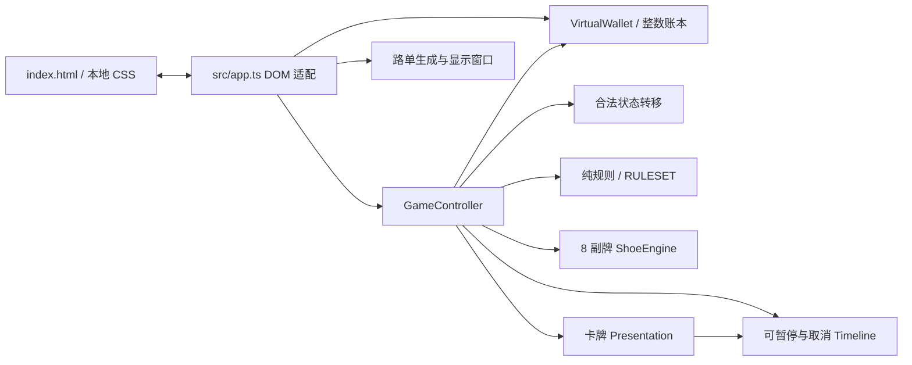

# 皇后娱乐 · Queen Entertainment

纯娱乐、虚拟筹码的单人百家乐模拟器。没有充值、提现、兑换或真实资金功能。

本次是 **PHASE 1 / M1：项目审查与核心基础重构**，不是整个 PHASE 1 完成版。现有单桌已迁移到严格 TypeScript 模块，并保持原玩法与静态部署入口。完整的 13 项原始项目审查见 [审查报告](docs/INITIAL_AUDIT.zh-CN.md)，范围与验证见 [交付说明](docs/PHASE1_M1.zh-CN.md)。

## 直接运行已构建版本

需要 Node.js 22 或更新版本，在项目目录执行：

```sh
node scripts/serve.mjs
```

打开终端显示的 `http://127.0.0.1:4173`。代码包自带 `dist/`，运行预览不需要安装依赖。不要直接双击 HTML：浏览器的 ES Module 需要通过 HTTP 加载。

## 修改与验证

项目使用固定版本 TypeScript 5.9.3、Tailwind CSS 3.4.19、pnpm 11.19.0，Node 24 已实测。按原型使用的 Tailwind 3 系列保留已有 utility 类；不在这一轮叠加框架/大版本迁移。

```sh
npm install --global pnpm@11.19.0
pnpm install --frozen-lockfile
pnpm check
```

`pnpm check` 编译 strict TypeScript、构建本地 CSS，并执行 Node 内置测试。`pnpm build` 和 `pnpm test` 可单独执行；修改源文件后先重新 build 再测。

`index.html` 引用 `dist/src/app.js` 和 `dist/table.css`；两者随源码提交，支持仓库根目录的静态托管和子路径。CI 检查构建产物与源码是否一致。修改源码后应一并提交 `dist/`。此次未修改线上部署设置。

## 核心边界



- `src/game/engine.ts`：点数、自然牌、补牌、对子、胜负、标准 5% 庄佣金、8 副牌、cut 阈值、可注入随机源。
- `src/game/wallet.ts`：一个虚拟筹码=100 整数单位。下注票据、加倍、清空、原子重押、锁定、结算与取消；余额只通过账本方法更改。
- `src/game/state.ts` / `controller.ts`：单局唯一负责人、合法状态、输入锁定、正常与失败恢复路径。
- `src/game/timeline.ts`：集中计时。单机练习在标签页隐藏时暂停，恢复时继续剩余动画时间；它不是未来多人房间的服务器时钟。
- `src/presentation/cards.ts`：使用实际牌靴槽口，统一 Web Animations 与时间线；动画不计算规则或余额。保留自动翻牌，还未实现咪牌。
- `src/game/roadmap.ts` / `src/presentation/road-window.ts`：大路正确性与窗口显示分开；窗口跟随最新结果，珠盘按六格整列裁切。

规则测试参考 [New Jersey Division of Gaming Enforcement，13:69F-3.9 补牌表](https://www.state.nj.us/oag/ge/docs/Regulations/CHAPTER69F.pdf) 第 190–191 页。界面使用的 `RULESET` 保留原程序真正执行的标准佣金玩法；错误的“庄 6 半赔”描述已移除。

## 当前限制

余额、历史与账本仍是**本次打开页面的内存数据，刷新会重置**；界面已明确提示。本版本不冒充服务端账本或持久账户。没有短信、数据库、房间、多人同步、LLM 或付费服务。代码可在本机无额外服务费用运行。

全新牌桌视觉、四角咪牌、实体筹码/收取/赔付动作、Audio Manager、Queen 角色资产与动作、完整移动 UX 都是后续 PHASE 1 工作。现阶段保留原桌结构并修复操作裁切，不把它称为最终美术。

真实 iPhone Safari、低端安卓 GPU、长期内存与 FPS 仍需实机测量；当前没有“全平台 60 FPS”结论。大路与账本保存完整会话历史，DOM 已窗口化，超长会话的增量计算/历史归档仍待后续处理。
