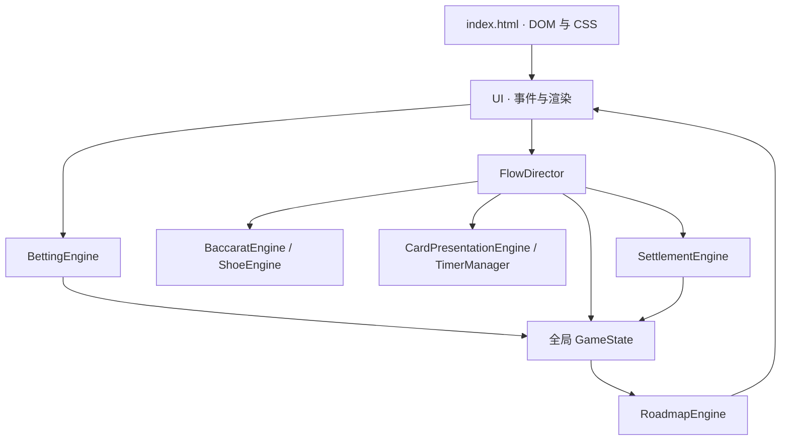

# 皇后娱乐 · PHASE 1 改造前审查

审查基线：`yuhua888-vip/-`，main 提交 `caa65a56361f8b6edb3d083ac9b815b69e221ddf`。仓库只有 `index.html`，47,345 字节。原文件逐字备份在 `legacy/index.html`。以下是源码审查；未经浏览器验证的布局问题以风险说明。

## 1. 当前项目架构

逻辑已有命名分组，但没有模块边界：投注引擎直接调用 UI，结算依赖全局状态，流程同时管理发牌、DOM、余额和计时。无后端、数据库、构建、自动化断言、资源目录或锁文件。

## 2. 现有功能 Inventory

| 功能 | 基线实现 | PHASE 1 保护策略 |
| --- | --- | --- |
| 8 副牌、Fisher–Yates、60–75 张 cut card | 有，Math.random | 保留牌鞋规模及切牌区间，增加可复现测试与安全随机来源 |
| A/10/J/Q/K 点数、自然 8/9、第三张表 | 有，主要规则正确 | 移为独立严格类型纯函数，并逐格测试 |
| 闲、庄、和、闲对、庄对 | 有 | 五个位置全部保留 |
| 50、100、500、1000、5000、10000 筹码 | 有 | 六档全部保留 |
| 初始虚拟余额 100000 | 有，仅内存 | 保留初始值，整数最小单位记账，设备本地保存 |
| CLEAR / DOUBLE / REBET | 有 | 保留，修复续押可用资金计算，增加单步撤销 |
| 点 DEAL 开局、停止投注、补牌、结果、下一局 | 有 | 保留手动开局，加入有界状态转换及统一时序 |
| 从牌靴飞牌、牌背、自动翻牌、点数徽章 | 有 | 保留来源与顺序，重做材质和轨迹 |
| 珠盘路、大路、庄闲和计数 | 有 | 保留并修正大路长连转列及开局和记录 |
| 手机断点样式 | 有 | 重做触控尺寸、滚动、安全区域 |
| 咪牌 / 四角拖动 | **没有** | 本阶段新增，不能称为“已保留的旧咪牌” |
| 皇后人物、动作、音频、设置 | **没有** | 本阶段建立基础版本 |
| 大眼仔、小路、曱甴路 | **没有** | 本阶段新增可展开视图并单独测试；不伪装成原有能力 |
| 登录、多人房间、好友、服务端余额 | **没有** | 保持 PHASE 2/3 范围，不添加失效按钮 |

## 3. 最大的 10 个技术问题

1. **规则自相矛盾**：桌面文案写庄六赔半，CONFIG 和 SettlementEngine 实际一律净赔 0.95。采用原程序实际的佣金规则为默认；另将庄六赔半作为明确可选规则，文案从同一规则配置产生。
2. **结算抹去小数**：`Math.round(grossPayout)` 会把 50 筹码的庄赢退回 97.5 变为 98。使用百分之一筹码作为整数最小单位。
3. **续押误拒绝**：rebet 先比较余额与上次投注，没有计入当前投注撤回后可用的筹码。替换投注必须一次验证、一次提交。
4. **投注入口不验证数据**：负数、NaN、无效位置可污染余额或赌注对象；当前按钮虽然提供固定数值，引擎本身不安全。统一金额与位置检查。
5. **状态只有字符串，没有转换约束**：任何调用方都能直接写 phase，错误路径无恢复。建立显式转换表。
6. **异步缺乏取消与收尾**：流程没有 try/finally；动画异常会留下锁定桌。TimerManager.clearAll 清除 timeout 后不解决 Promise，且没覆盖动画及结算自己的 timeout。
7. **刷新完全重置**：余额、牌鞋、上一注和历史都仅在内存。设备本地试玩需要完整原子快照及中途牌局恢复；不能冒称服务端账户。
8. **幂等性只记最后一个 ID**：只挡连续同局调用，不能挡 A→B→A；标记发生在计算前，失败可能锁死结算。结算使用稳定牌局 ID 和账本去重。
9. **大路长连布局不正确**：换色用 matrix.length，长连横移后下一个色从过远列开始；开局和直接丢弃。分开“每串起始列”和当前占位。
10. **开发测试污染生产状态且无断言**：每次启动跑 100 局，通过真正 SettlementEngine 改 settledTransactionId；测试初始发牌顺序 PPBB 与实盘 PBPB 不同，也没有失败退出。移到独立自动测试。

## 4. 最大的 10 个 UI / UX 问题

1. 品牌仍为 EMPRESS ROYALE，未采用“皇后娱乐 / QUEEN ENTERTAINMENT”。
2. `$`、LIVE、VIP 实桌措辞会混淆虚拟模拟属性，应直接写虚拟筹码和本地试玩。
3. 深绿、金色装饰占主导，和目标午夜蓝绿、克制金属材质不一致。
4. 主投注区是无语义 div，没有键盘操作和焦点提示。
5. 大量 7–10px 文本及小按钮，触控和可读性不足。
6. body 固定高度且禁止滚动；低矮屏幕、字体放大、浏览器栏变化有裁切风险。
7. viewport 禁止缩放；全局 user-select:none 影响辅助操作。
8. 无效投注、余额不足、不能续押等都静默返回，没有原因提示。
9. 投注金额替换成文本胶囊，没有筹码轨迹、实体堆叠、声音反馈。
10. 结算只是标题与余额瞬时变化；筹码瞬时清除，没有本局净收益、收取和赔付过程。

## 5. 当前动画问题

CSS transition、requestAnimationFrame、散落 timeout 和 TimerManager 混用；动画完成以固定时间猜测，不监听实际完成，也无取消机制。大量 transition:all 和动态 box-shadow 不利于稳定帧率。缺少 reduced-motion、后台恢复和统一速度档位。

## 6. 当前发牌问题

优点：真实 DOM 牌靴是起点，P1→B1→P2→B2 顺序正确。问题：320ms 单段平移，只有随机小旋转，没有抽取、落桌减速的完整节奏；靴坐标加 4px 但终点位移没扣除，存在落点偏差；飞牌和最终卡牌是两个实体，中途 resize 会造成跳变；结束用 timeout 替换节点。移动样式使用非标准 `h-18`，应显式固定宽高比避免牌高不确定。

## 7. 当前咪牌问题

完全没有咪牌系统。现有 rotateY(180deg) 是整张自动翻牌，不能当作局部卷角。需要独立交互状态、四角判定、Pointer Events/捕获、拖动距离、裁剪牌背与卷折阴影、阈值回弹、完成提交、键盘开牌及超时自动开牌。

## 8. 当前筹码问题

六个面额选择可保留，但下注区只有金额标签。应新增面额组合、上限受控的可见堆叠、从托盘到下注区的飞行、原路撤回、加倍新增、续押重建、输方收回与赢方推出。余额必须先经统一账本合法提交，动画不可决定金额。

## 9. 皇后实现路线

V1 使用同一角色的四姿态二维资产：等待、停止下注、发牌、赔付。DealerController 只消费牌局事件，按状态切换姿态、视线和轻微呼吸；牌靴和卡牌轨迹独立。预制姿态过渡是基础动作版本，并非连续手指骨骼动画。预留 DealerBrain 接口但不接大模型。后续专业序列帧/视频或 rig 动画才能提升连续手牌接触精度，不用 CSS 冒充人体物理。

## 10. 保留哪些代码

保留并移植正确的点数、natural、Player/Banker 第三张判定，Fisher–Yates 算法、8 副牌和 cut-card 参数，五区和六档面额，CLEAR/DOUBLE/REBET 的产品语义，PBPB 发牌顺序、对子/和退本规则、珠盘与大路表达。旧版完整独立归档便于逐项核对。

## 11. 重构哪些代码

GameState→受约束 GameSession；BettingEngine/SettlementEngine→纯规则与整数账本；FlowDirector→单一时序和 presentation port；ShoeEngine→可序列化且禁止局中补鞋；CardPresentationEngine→可取消 WAAPI 动画和咪牌控制器；UI→小型 TypeScript DOM 模块；RoadmapEngine→无覆盖的纯布局；配置→规则、动作、音频偏好分离。

## 12. 删除哪些代码

只从新运行入口删除：生产启动的 100 局模拟；冲突的硬编码赔率文案；失去用途的全局可写单例和未使用 phase；散乱 timeout；CDN 运行时 Tailwind、Font Awesome 和字体依赖；全局禁缩放与裁切。保留原版归档，功能先迁移和验证，随后替换入口。

## 13. PHASE 1 执行顺序

1. 固定原始提交、保存原版，建立以上清单。
2. 严格 TypeScript 工程与可重复构建；纯数学引擎、牌鞋、两种明确规则；断言测试。
3. 整数账本、原子投注、结算幂等、完整设备本地快照、刷新恢复及同浏览器多标签互斥。
4. 游戏状态转换表、单一 timeline、取消/错误恢复及后台归位。
5. 午夜蓝绿牌桌、品牌、五投注区、六筹码、响应式版式。
6. 筹码实体和轨迹、从牌靴发牌、高质量程序牌面、四角咪牌。
7. 收筹码和赔付、AudioManager、皇后四姿态事件适配。
8. 路单、设置、reduced-motion、键盘/触摸、设备本地存储提示。
9. 自动规则/钱包/状态/路单测试，浏览器完整流程和移动端操作检查。
10. 将代码、测试结果和剩余风险放入独立 GitHub 改动，供审查；不直接覆盖线上主分支。

### 明确的阶段边界

本阶段为单机虚拟筹码模拟器。设备本地快照不是服务器安全账户，也不提供多人同步、登录、短信或充值。房间及网络重连测试要在服务端房间存在后实施，当前不能虚构“通过”。本阶段不产生按次 AI API、短信、数据库费用。
