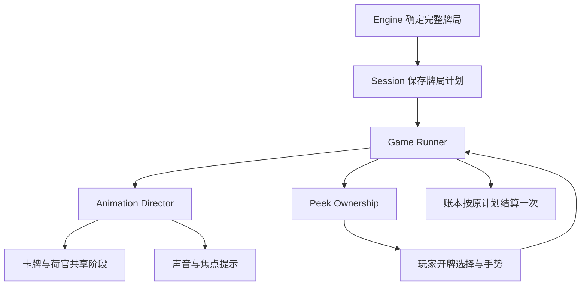

# 发牌、开牌与咪牌专项重构

基线：PR #1 的 `587bf31319f19218dae88cb292489f6e1ae780c2`。保留现有开发分支，未合并 main。

**状态：实现与自动回归已完成；实际视觉、听感和手机体验尚未验收。** 当前会话已有明确的浏览器 URL 安全策略阻断；未通过其他浏览器、地址或间接执行绕过。下面的“已验证”只代表真实执行过的检查，不代表观察过浏览器中的动画。不能把此版本标成“电影级验收通过”。

## Current Feature Inventory

| 现有功能 | 处理 | 验证证据 |
| --- | --- | --- |
| 100,000 初始虚拟筹码、整数最小单位账本 | 保留 | 余额、退款、非法输入、重复结算测试 |
| 闲、庄、和、闲对、庄对五区，六档筹码 | 保留 | 31 种非空投注组合的权限覆盖；HTML 与资源检查 |
| 撤销、清空、加倍、续押 | 保留 | 原有 session 回归测试 |
| 八副牌、切牌区间、安全随机、跨局洗牌 | 保留 | 416 张牌检查、2,000 局种子模拟 |
| 闲庄依序发牌、Natural、全部补牌规则 | 保留 | 发牌顺序、完整补牌表、四至六张牌测试 |
| 经典佣金、庄六赔半、对子与和独立赔付 | 保留 | 97.5 小数赔付与独立结算测试 |
| 五种路单、最近 100 局记录 | 保留 | 路单长连、开局和、1,000 条不覆盖测试 |
| 本地存档、刷新恢复、跨标签页保护 | 保留 | 快照校验、保存失败回滚、单桌锁与修订号测试 |
| 自动开牌、两档节奏、减少动态效果 | 保留并调整 | 流畅档为从容档的 0.88 倍时长；减少动态效果保留时间节奏 |
| 总音量、环境、音乐、音效与静音 | 保留并扩展 | 类型与生命周期检查；实际听感待验收 |
| 四角咪牌、键盘与直接开牌 | 重构 | 曲面、方向、阻力、回弹、取消与权限测试；实际指针交互待验收 |
| 桌面/移动端布局、帮助、设置 | 保留并重排 | CSS 解析、唯一 ID 与模块检查；实际排版待验收 |
| 四姿态皇后、阶段文案 | 保留并绑定时间轴 | 阶段连接与共享时长代码检查；尚非独立手臂骨骼动画 |
| 完整原版 `legacy/index.html` | 未修改 | 与上一版 Git blob 相同 |

## 根因及修改

| 问题 | 旧代码根因 | 新路径 |
| --- | --- | --- |
| 发牌像程序搬运 | `TableView.deal` 一段 680ms 动画，下一张只等 140ms | 六段 Deal Timeline，完整单张约 2.18–2.55 秒 |
| 开牌无期待 | `flip` 两段各 220ms，立即更新点数 | 期待、抬边、背面翻转、正面翻转、落桌、延迟点数 |
| 咪牌权限错误 | `banker > player` 选一个方向，只允许第二张与第三张 | `ownership.ts` 明确每一种投注组合，所有己方牌可咪 |
| 对手牌没有选择 | 按发牌顺序交错自动翻开 | 先处理对手两张，再处理己方；对手可咪或直接开 |
| 咪牌是平面擦除 | Canvas 三角裁切叠渐变，没有真实曲面 | WebGL 细分纸张、正反纹理与深度；Canvas 同形变降级 |
| 速度与手感生硬 | 位移、音效、荷官分别开始；统一快节奏 | Director 事件边界绑定，分层纸张音效与拖动速度摩擦 |
| 设备越慢发牌越快 | 低核心数强制 reduced，reduced 时间缩为 6% | 限制绘制 DPR；不因设备性能压缩游戏时间 |
| 小字与矩形组件过多 | 大量 7–11px 标签、矩形投注区、控制区纵向堆叠 | 弧形桌布投注线、较大关键文字、手机底栏合并 |

## 时间轴与游戏规则分离

没有在动画中重新抽牌。中断和重新打开仍使用预先保存的同一份牌局。

`Motion` 集中持有取消信号、WAAPI 动画、定时等待和 tween。`AnimationDirector` 串行执行有名字的 cue，并发出开始、结束、取消记录；并行的牌和荷官动作必须在同一 cue 结束后才能进入下一段。选择界面的超时使用真实时间，开发慢动作不会让其无限等待。

### 默认逐张发牌时长（毫秒）

| 卡牌 | 准备 | 抽出 | 行进 | 落桌摩擦 | 停稳 | 间隔 | 合计 |
| --- | ---: | ---: | ---: | ---: | ---: | ---: | ---: |
| 闲第一张 | 440 | 388.8 | 712.8 | 367.2 | 210 | 360 | 2478.8 |
| 庄第一张 | 330 | 360 | 660 | 340 | 210 | 360 | 2260 |
| 闲第二张 | 330 | 338.4 | 620.4 | 319.6 | 210 | 360 | 2178.4 |
| 庄第二张 | 330 | 370.8 | 679.8 | 350.2 | 290 | 530 | 2550.8 |

四张合计约 9.47 秒，不含确认发牌后的 5 格准备倒计时。此倒计时是**已确认投注后的发牌准备**，不是仍能追加下注的服务器投注窗口；文案明确“投注已确认”。到零时停止下注文案、荷官阶段和音效同步切换。

普通翻牌自身为 210ms 抬边 + 490ms 翻转 + 240ms 落桌，共 940ms；此外有 310ms 期待和 210ms 点数延迟。第三张放大到 1.18 倍并增加等待；接近点数或已可见的 Natural 使用更轻的延长。悬念仅依据已打开的牌和是否为第三张，**不会通过提前变慢泄露隐藏牌值或结果**。

窗口宽度改变时重新适配当前移动物件，后续卡牌继续执行。手机地址栏造成的仅高度变化不会跳过整局。隐藏标签页或离开页面仍按既有保存/恢复约定安全结束表现层。

## Peek Ownership System

| 投注 | 第一阶段 | 第二阶段 | 补牌 |
| --- | --- | --- | --- |
| 仅庄主注（可带和/对子） | 闲：选亲自咪或直接开 | 庄：第一、第二张都优先咪 | 所选方式延续到该方第三张 |
| 仅闲主注（可带和/对子） | 庄：选亲自咪或直接开 | 闲：第一、第二张都优先咪 | 同上 |
| 庄闲同时下注 | 闲两张都可咪 | 庄两张都可咪 | 双方第三张都可咪 |
| 只有和或对子 | 先选咪牌方，然后选对手开牌方式 | 所选方所有牌可咪 | 同上 |
| 设置开启自动开牌 | 所有牌依次使用普通开牌动画 | 不弹出手动选择 | 仍逐张开，不同时翻 |

选项等待 15 秒后采用界面标注的选项。咪牌静置 45 秒后直接开；持续互动会重置静置计时，一张牌最多等待 180 秒。直接开牌、Escape、键盘、失去指针捕获和取消都有确定路径。时间限制不改变任何牌值。

## 图形、物理与声音取舍

| 技术 | 决策与理由 |
| --- | --- |
| DOM + Web Animations API | 用于常态卡牌、筹码与桌面；一次只移动少量对象，便于可访问性与现有 UI 对接 |
| 自研 Animation Director | 沿用现有可取消 Promise/WAAPI 结构；提供串行 cue 与调试事件，没有引入重复调度器 |
| WebGL + Vertex/Fragment Shader | 仅咪牌使用；36×50 细分网格，两个纸张纹理，纸面与阴影两次绘制；纸面深度、曲率法线和正反面切换 |
| Canvas 2D | 缓存 6 个筹码材质、牌面和牌背；WebGL 不可用或 context lost 时，用 12×18 网格与相同形变公式降级 |
| Pointer Events + requestAnimationFrame | 每次手势缓存测量，不在 pointermove 反复读布局；阻力、弹簧、方向识别、捕获与取消；停稳后停止渲染循环 |
| Web Audio API | 抽牌、移动、落桌、摩擦分别与 cue 同步；手势只保留一个连续摩擦声源，速度控制增益、播放速率和滤波 |
| 视觉伪物理 | 筹码抛物线近似、旋转、落桌压缩与微回弹；不让随机刚体模拟干扰下注与结算 |
| Three.js / PixiJS / GSAP | 已评估；本轮只有一个高级纸张网格，现有 DOM 与时间轴无需增加整套运行时依赖 |
| WebGPU / Houdini / OffscreenCanvas / Workers | 暂不引入；当前目标先是可取消的少量动画与一个交互网格，尚无实机性能证据要求迁移线程或 API |
| Rive / Spine / Spline / 3D 荷官 | 缺少连续手臂与发牌绑定所需的适配资产；本轮保留并同步 2D 姿态，不虚报已经实现真人手部骨骼 |
| Matter.js / Rapier / Cannon / Howler / Tone | 当前受控筹码运动及少量音效不需要这些运行时 |

本轮未新增第三方运行时依赖。参考的官方资料：[MDN WebGL 最佳实践](https://developer.mozilla.org/en-US/docs/Web/API/WebGL_API/WebGL_best_practices)、[WebGL 与 HTML 混合](https://developer.mozilla.org/en-US/docs/Web/API/WebGL_API/Tutorial/Getting_started_with_WebGL)、[Three.js PlaneGeometry](https://threejs.org/docs/pages/PlaneGeometry.html)。具体取舍是本项目判断，不是文档对本项目效果的保证。

## Animation Studio（仅开发环境）

执行 `npm test` 后 `npm run dev`，右下角出现 Animation Studio。Vite 仅在开发服务器注入入口；构建脚本会移除编译后的 dev 目录，生产 HTML 不含入口。

包含 Deal Speed、Flight、Landing、Between Cards、Reveal Speed、Peek Resistance、Threshold、Spring、Camera Zoom、Audio Volume、Chip Flight、Dealer Speed。荷官速率会同时拉伸对应发牌 cue，保持与卡牌同步。参数应用到后续 cue，不中途截断当前动作。

0.25× / 0.5× / 1× 使用同一表现层时间倍率。提供六张补牌、Natural 8/9、和局的固定调试牌序，以及发牌、开牌、四角咪牌单独回放。调试牌不写入钱包、牌靴或账本，播放期间锁定普通操作，停止后恢复真实牌桌。

面板显示有上限的 cue 记录和实际 RAF 帧间隔采样（平均帧率、p95、>25ms 帧数）。它是浏览器帧间隔观测，不是 GPU 耗时，也不能证明设备不会发热。

## SELF REVIEW 与主动返工记录

| 检查发现 | 已进行的返工 | 已执行的验证 |
| --- | --- | --- |
| 一段动画无法表达停稳与间隔 | 拆成六段并设定四张不同节奏 | cue 顺序、取消与最小时长测试 |
| reduced 继承 `rotateY(-90deg)` 可能使牌面不可见 | 去掉空间动画时同步清理已有 transform / clipPath，仍保留等待 | 专门的 reduced-mode 可见性回归 |
| 低性能检测把游戏加速 | 改为只限制绘制 DPR，取消 CPU 核心数加速逻辑 | 时间倍率测试 |
| 视口变化提前结算整局 | 只结束当前飞行动画并适配落点，不跳过后续牌局 | 代码路径审查；实际旋转待验收 |
| 卷曲完成段有部分顶点越出画布 | 调整弯曲范围，完成阶段改为展开并整牌翻转，扩大透视距离 | 四角、101 个进度、5 个方向与网格采样边界测试 |
| 背面纸张的正面纹理可能镜像 | 为正面做对应 UV 变换，Canvas 同步处理 | 正反面映射代码审查；字体实显仍待验收 |
| 停止牌局后纸张声音可能仍持续 | 追踪短声音源，取消时软淡出并释放连接 | 音源与取消生命周期审查 |
| 慢动作下牌先到而荷官未结束 | 荷官与牌共同使用 cue 时长，倍率同步 | Director / motion 测试与共享时长检查 |
| 增大文字后控制区高度过大 | 缩短桌面上方空白，将手机确认按钮与投注操作合为一行 | CSS 尺寸和结构审查；首屏截图待验收 |

### 已执行

- 严格 TypeScript 与静态构建通过。
- 43 项自动测试通过，包含全部原有 27 项测试的范围以及新增的权限、节奏、取消和曲面回归。
- 2,000 局种子模拟仍通过。
- 80 个 HTML ID 唯一；编译模块的相对引用完整；CSS 可解析。
- 生产包没有开发调试入口与编译后的 dev 目录。
- 原版、规则引擎、账本、存档格式与路单算法不变。

### 尚未通过的体验门槛

- [ ] 在真实桌面浏览器以 1× 和 0.25× 播放、观察并调整，确认没有跳帧、突变阴影、露牌镜像或残余“位移组件”感。
- [ ] 360/390/430px 手机、横屏、200% 文字缩放的实际布局检查。
- [ ] iOS / Android 的四角指针、触摸阻尼、回弹、长按、地址栏变化及 context lost 交互。
- [ ] 自己完整体验下注庄、下注闲、双边、和、对子、自动开牌以及补第三张。
- [ ] 实际耳机/扬声器听感和振动强度；WebGL 着色器在浏览器中的编译与绘制。
- [ ] 连续游戏的帧率、内存与设备发热；不能用数学采样或 Node 测试冒充 60 FPS 实测。
- [ ] 连续荷官手臂动画所需资产与绑定；当前为按 cue 同步的四姿态 2D 角色。

这些未验收项使“高级体验已经完成”的结论不成立。保留草稿，等待可访问的实际浏览器环境完成播放—观察—返工循环。
