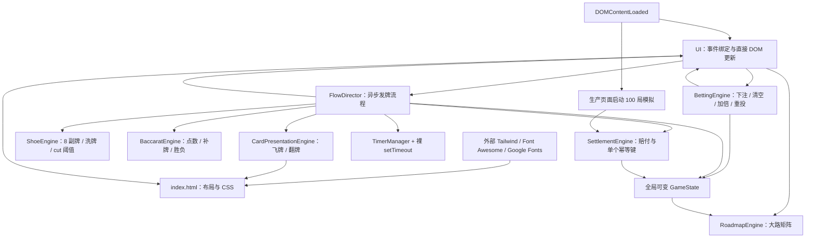

# 《皇后娱乐》原始代码独立审查

审查基线：GitHub `yuhua888-vip/-`，提交 `caa65a56361f8b6edb3d083ac9b815b69e221ddf` 的 `index.html`，共 1131 行。下文 `L` 均指该原始版本，不能与改造后的行号混用。已完整阅读用户需求与全部 HTML、CSS、JavaScript；本审查不修改原文件。

结论：这是有完整单人百家乐闭环的单文件原型，规则核心已有可保留基础，但距离所描述的互动产品还有明显差距。当前确实存在下注、余额、补牌、正反面翻牌、珠盘路和基础大路；没有咪牌、皇后人物、声音、设置、房间或账户。不能把后者写成“已保留”或把自动翻牌称为咪牌。

## 1. 当前项目架构图



实际边界：页面声明 L1–13；CSS L14–206；DOM L209–421；配置 L429–450；阶段常量 L452–463；规则 L465–519；牌鞋 L521–565；共享状态 L567–594；定时器 L596–612；下注和结算 L614–699；卡牌表现 L701–760；大路 L762–800；UI L802–917；流程 L919–1071；模拟与启动 L1073–1127。

已经按对象命名分组，但仍是同一个全局脚本。`BettingEngine` 调 UI，`SettlementEngine` 修改全局状态，`FlowDirector` 同时负责规则顺序、DOM、余额和动画。没有模块系统、严格类型、编译构建、独立测试或后端边界。

## 2. 现有功能 Inventory

| 编号 | 已存在的真实能力 | 原始位置 | 保留目标与限制 |
|---|---|---|---|
| F01 | 单桌页面、品牌栏、桌号、鞋号、余牌与局号 | L211–281 | 信息保留，品牌改为皇后娱乐；桌号是静态展示 |
| F02 | 深绿桌布、木色包边、牌靴和弃牌架 CSS | L43–147、L237–281 | 空间分区和锚点保留，弃牌架目前无收牌逻辑 |
| F03 | 闲／庄各三个牌位及点数徽标 | L284–320、L843–858 | 必须完整保留补牌位和分数显示 |
| F04 | 闲、庄、和、闲对、庄对五种投注 | L323–357、L578–584 | 五种玩法都要保留；对子可折叠但不可删掉 |
| F05 | 50／100／500／1000／5000／10000 六种筹码选择 | L402–409、L834–841、L899–904 | 选择环与下压已有；没有桌面实体筹码 |
| F06 | 下注即扣余额、各区域显示投注额 | L615–625、L815–831 | 保留行为，补输入校验、事务记录和动画 |
| F07 | 清空、加倍、按上局重投 | L627–655、L388–399 | 三个操作都要保留；CLEAR 是整单清空，不是逐笔撤销 |
| F08 | 手动 DEAL、无投注不发牌、运行中禁止再次发牌 | L921–929、L915 | 当前有同步阶段检查和按钮禁用，应保留而非宣称没有防重复点击 |
| F09 | 八副牌、Fisher–Yates、余牌 60–75 随机 cut 阈值、局前换鞋 | L430–440、L530–562、L931–939 | 可保留算法；没有真实 cut card 可视对象或烧牌流程 |
| F10 | A=1、10/J/Q/K=0、模 10 计点、天生 8/9、对子判断 | L470–493 | 规则核心保留，使用确定性测试锁定 |
| F11 | 闲第三张和庄第三张标准条件表 | L495–511 | 可保留；当前流程在天生牌检查后才调用 |
| F12 | 主流程按 P1→B1→P2→B2 发牌，按需发第三张 | L951–969、L991–1028 | 顺序必须保留；原模拟器采用不同初始抽牌顺序 |
| F13 | 从牌靴附近到牌位的飞牌、落桌缩放、180° 自动翻牌 | L154–205、L722–759 | 确实已有基础动画；不能称为真实取牌链或咪牌 |
| F14 | 闲 1:1、庄 0.95:1、和 8:1、对子 11:1；和局退庄闲本金 | L435–440、L673–696 | 保留标准佣金规则；修正文案和金额精度 |
| F15 | 宣告结果、更新余额、延迟 2.2 秒开放下一局 | L1035–1070 | 保留闭环；当前筹码被清零，没有收取与赔付动画 |
| F16 | 内存历史、庄闲和计数、珠盘路、带和局斜线的基础大路 | L593、L763–799、L860–895 | 保留并修复龙尾与开局和局；没有大眼仔、小路、曱甴路 |
| F17 | 桌面断点样式、手机高度适配 | L52–79、DOM 的 md 类、L1122–1126 | 有响应式基础；不等同独立移动 UX 或安全区完成 |
| F18 | 打开页面自动跑 100 局模拟并输出统计 | L1074–1119 | 意图保留为测试，生产启动方式应删除 |

确实不存在：鼠标／触摸拖动咪牌，四角与回弹；荷官图像和动作状态机；Audio Manager、音乐、环境音或音量；逐笔撤销；下注倒计时；持久化余额／账本；正式设置；大厅、登录、短信、房间、WebSocket、好友、重连；进阶路单；自动化断言测试与 E2E。前期不应因为这些尚未实现，就立即铺开第二、第三阶段。

## 3. 最大的 10 个技术问题

| 排序 | 问题、证据与具体后果 | 修复方向 |
|---|---|---|
| T01 | **规则契约冲突。** L265 显示“Banker Wins 6 Pays 1:2”，L354 显示 0.95，实际 L675–676 对所有庄胜均按 0.95 赔付。玩家从界面无法知道到底采用哪套规则。 | 本期明确保留已有标准 5% 佣金规则；规则配置成为文案、引擎、测试的唯一来源。不要在 UI 偷换成另一规则。 |
| T02 | **赔付取整改变收益。** L695–696 对返还和净收益 `Math.round`。原始 50 庄注命中时应返还 97.5、净赢 47.5，实测返回 98、48。L1048 直接入账且没有账本，刷新又回到 L574 的 100000。 | 用整数最小单位，例如 1 虚拟筹码=100 单位；结算结果与入账原子提交，记录 before/after/source/roundId。单机阶段只承诺本地模拟持久化，服务端余额留后续。 |
| T03 | **下注边界没有校验。** L616–621 只判断阶段与余额；未检查目标存在、数值有限、金额正数或单位。实测 `placeBet('player', -50)` 成功并把余额 100 增到 150；未知目标可产生 NaN。当前按钮传固定值，风险来自函数契约和后续集成，不应夸大为已有线上资金漏洞。 | 严格 BetTarget 类型，加运行时校验与整数单位；失败应返回可显示的明确原因。 |
| T04 | **REBET 退款前就判定余额不足。** L649 在 L650 的 `clearBets()` 之前检查。实测可用余额 50、当前闲注 100、上局庄注 100，账户已有足额可撤资金仍被拒绝。 | 以“可用余额+将撤销的当前投注”判断，并将撤销与重投作为一个事务。另明确 REBET 是替换当前票据。 |
| T05 | **幂等仅覆盖相邻重复。** L661–662 仅保存最后一个 ID，而且在计算前写入。实测 A→B→A 的第三次被接受；L1110 的生产模拟又改写同一键。它不会在默认单击流程必然双付，但不能支撑重放、恢复和异常重试。 | 以稳定 roundId+operationId 和已结算记录判重；先完成校验/计算，再原子提交。测试状态与真实会话隔离。 |
| T06 | **阶段名称不是完整状态机。** L453–463 只有常量；L926、L933、L952 等直接赋值，无转移表、进入/退出条件、动作完成约束或错误恢复。IDLE、RESULT_REVEAL 没有实际流程用途。异常 Promise 可能让 DEAL 长期禁用。 | 建显式状态图、事件、操作许可与可恢复错误状态；规则状态与荷官表现状态分离，由同一牌局事件驱动。 |
| T07 | **定时器与动画生命周期不统一。** L742、L757、L1057 绕过 TimerManager；`clearAll()` L608–610 只清 timeout 不完成/reject 对应 Promise，且全文件没有调用。L165 的 450ms 与 L446 重复维护；后台、resize、取消均无策略。 | 统一可取消 timeline，使用动画完成信号和受控 deadline；取消必须结束等待；可见性恢复后按牌局状态重建表现。 |
| T08 | **“100 局模拟”不是可证明正确的测试。** L1074–1115 无规则矩阵、金额守恒、预期结果断言或失败退出码；L1081–1082 按 P1/P2/B1/B2 抽牌，与实际主流程不同；还污染真实幂等键。 | 独立 test runner；固定牌鞋、确定性 RNG、补牌表全覆盖、结算例表、重复操作与状态转移测试。仅做随机次数统计不能发现舍入或重投问题。 |
| T09 | **路单算法和布局有实质缺陷。** L790 用 `matrix.length` 作为新庄闲列，长龙尾横向伸展后下一色列被推得过远；实测 P×7→B，新 B 在第三列而非第二列。L770–780 丢弃开局和局。L380 是 6 行 CSS grid，却在 L876–890 加入“整列 flex 容器”，父子布局模型不一致。 | 独立记录主列起点与龙尾坐标，加入开局和、长连、转色和碰撞 fixtures；统一使用逐格 grid 或逐列 flex。 |
| T10 | **单文件与运行时 CDN 使交付不可复现。** L8–12 依赖公网脚本、字体；L424–1127 全部全局 JS，无严格 TS、依赖锁、构建、测试配置。每局 L860–895 全量重建无界历史路单。 | 渐进拆出 strict TypeScript 领域模块与最薄 DOM 适配，固定依赖；静态页面先保留可用。历史按鞋分组与窗口渲染，再按实测设性能预算。 |

额外边界：`draw()` L556 在空鞋时静默新洗，会掩盖调用方错误；默认流程每局前 cut 检查通常能避免空鞋，但领域 API 应显式拒绝局中换鞋。Fisher–Yates 本身值得保留，随机源应可注入以复现 Bug；单机模拟 `Math.random` 不能冒充未来服务器权威随机。

## 4. 最大的 10 个 UI / UX 问题

| 排序 | 具体问题与证据 | 设计处理 |
|---|---|---|
| U01 | 品牌仍是 EMPRESS ROYALE / VIP（L6、L215、L370、L710），且核心位置没有 Queen 人物。 | 先统一中英品牌、Q 纹章与角色舞台；人物不压住卡牌。 |
| U02 | `$`、Bankroll、LIVE 等表达（L231–232、L256、L274、L816）与纯虚拟娱乐定位不清；混杂的庄 6 文案进一步削弱信任。 | 使用“虚拟筹码”及模拟说明，规则入口由当前配置生成。 |
| U03 | 字号普遍 7–10px，重要手牌面也只有 9/10px（L713–715）；L5 禁止缩放，L24–28 全局禁选中。 | 放大关键信息、恢复缩放，说明文字可以选择；低优先级装饰删减。 |
| U04 | 注区和筹码都是 div+click（L326–355、L404–409、L899–909），无键盘焦点、选中语义或禁用状态。 | 使用按钮/可访问的选中控件；清晰焦点、名称、禁用与动态状态播报。 |
| U05 | 手机是大桌缩小：固定高顶栏/路单/底栏、全页 overflow hidden（L35–36、L238、L363、L386），多组底栏 flex-wrap 可能挤压牌区；未读 safe-area inset。 | 手机上筹码和操作靠拇指，路单默认收起，允许必要纵向滚动；处理安全区。`h-18` 牌位类（L295 等）未在源码定义，须在实际 CDN 版本中验证尺寸。 |
| U06 | 不可执行操作没有原因。L618、L639、L649 直接 return，UI L908 不读取失败值；除了 DEAL，其他下注按钮在发牌中看起来仍可用。 | 每个操作即时提示余额不足/无投注/已封盘，同时按阶段禁用。 |
| U07 | 个人信息只有余额；本局总投注、本局净输赢、上局票据和角色身份均不可见，`netProfit` 算了却未渲染（L686、L1047–1055）。 | 最小玩家条显示昵称、虚拟余额、当前押注和结算净值。 |
| U08 | 五个下注区全部常驻，两个对子与和区并列在主注之上（L325–343）；默认路单占固定高度且字极小（L363–380）。 | 庄/闲/和为主层级，保留对子展开入口；路单折叠与分层展示。 |
| U09 | 下注、加倍、撤回、赔付只有数字跳变或清空（L620–643、L826、L1048、L1063）；选中有金圈但筹码无真实体积和桌面归属。 | 引入可计数筹码实体、从托盘到注区的轨迹与回收/派彩动作，数值变化同步。 |
| U10 | 牌局情绪全靠顶部短文本：等待无限时、DEAL 一按就锁定发牌、全部强制自动翻牌、没有人物或声音，结果 2.2 秒后被下一局宣告覆盖（L925–953、L974–979、L1051–1069）。 | 加停止下注过渡、取牌节奏、可选咪牌焦点、结果停留和可读的结算记录；声音与减弱动画选项同时设计。 |

浏览器基线已由主审查同步验证：1280×720 下，大圆角与 `overflow-hidden` 实际裁掉下方主注区域及 CLEAR/DEAL；390×844 下 viewport 宽度正确，但底栏操作按钮只有约 29/32px 高，左下角也存在圆角裁切。这些属于已观察到的视觉缺陷。尚未完成真机 Safari 或 FPS 测量，不能把源码推断扩展成全平台实测结论。

## 5. 当前动画系统问题

已有三个层级：CSS transition、`dropImpact` keyframes、JS await/timeout。只有五个 timing 常量，没有共用 easing/token、可取消动作、动画资源清理、减少动态效果设置、音效同步或荷官动作。`transition: all`（L102）和 box-shadow 动画（L194–205）扩大重绘范围。动画结束依赖时钟推测，不依赖渲染完成；标签页后台节流时也无恢复策略。

第一步不用上大型动画框架。建立小型 Timeline/AnimationCoordinator：动作具有 id、roundId、owner、duration、完成/取消语义；主要位移使用 transform/opacity，纸牌曲面留独立渲染器；模型先确定结果，表现按事件播放。对 reduced-motion 提供短淡入而非硬等待完整时长。

## 6. 当前发牌系统问题

- **值得保留：** 实际从已存在的牌靴锚点读坐标，按 P1→B1→P2→B2 发牌，第三张遵从规则，不是每张无关随机结果。
- **取牌位置不准确：** L724 获取整个 `shoe-chute-origin` 外盒；视觉 DEAL SLOT 是内层 L276。卡牌从外盒左上角+4 开始，而不是槽口/手指实际取牌点。
- **落点跳变：** L732–733 起点加 4px，但 L739 只用两个 rect 的差，飞牌终点相对目标多 4px；L743–746 换成真实卡牌时回到格内。飞行随机旋转也没有传给落桌卡牌，造成方向复位。
- **动作链过短：** 320ms 只有一次 translate+rotate，没有抽出/手移/滑行/摩擦减速的阶段；发牌暂停 180ms，所有座位共用轨迹模式。
- **时序存在视觉空档风险：** 新插入飞牌后仅一次 requestAnimationFrame 改 transform，没有独立初始帧建立保证；当前以 timeout 替换节点，窗口尺寸变化时未重算目标。
- **卡牌生命周期不完整：** 旧牌在下一局开始 L943–944 直接删除；弃牌架从未收牌，剩余牌数在第一轮四张后才统一更新。

改造应保持一个 CardId 对应一个可移动实体，让位置、角度、正反面和所有权连续；发牌端锚点、手牌锚点和弃牌锚点来自统一舞台坐标。每张动作可由一个 timeline 串起，完成后再允许后续翻面或咪牌。

## 7. 当前咪牌系统问题

**当前没有咪牌系统。** L753–757 只是添加 `flipped`，L169–170 是整牌 `rotateY(180deg)`；全文件没有 pointer/touch 拖拽、角点识别、局部牌面遮罩、翻开阈值、回弹或咪牌状态。这是新增功能，不能在报告中说原咪牌被保留。

V1 实现独立 `SqueezeController`：四角命中→pointer capture→由角点内向拖动距离计算进度→局部牌面遮罩、卷角和接触阴影→松开后阈值判定。未达到阈值回弹，达到阈值一次性发出 reveal 事件；同时有“直接开牌”按钮、键盘替代、超时策略与 reduced-motion 路径。牌本体始终在场，不能靠删背面/整牌消失充当咪牌。先做可信的轻量 2D/2.5D 近似，再以实际移动端帧率判断是否值得加 WebGL 曲面。

## 8. 当前筹码系统问题

筹码选择器已有六个面额的圆形控件、颜色、虚线边、阴影和选中圈；下注后 `chip-stack-anchor`（L823–829）只插入一个金额文字徽标，没有筹码对象、面额组合、厚度或堆栈。

因此落桌、加倍加栈、逐笔撤销、重投恢复原位置、输注回收、赢注派彩、筹码碰撞音均未实现。CLEAR 目前是五区全清，不是撤销最后一笔。工程上先把投注票据/事务和视觉筹码拆开：精确金额由账本管；视觉按面额分解并设最大可见数量，多笔下注保留 transactionId，堆栈聚合不能反推余额。先预扣并完成事务，再播落桌；取消动画不能撤销已确认的领域账务。撤回和加倍各自有完整事务和动画，而不是交换 DOM 徽标。

## 9. Queen 荷官实现路线

V1 采用原创 2D/2.5D Queen 主视觉与预制动作资产。人物定位是古典皇室+现代高定，覆盖肩颈、冷静表情和克制徽章；镜头留出桌面、手部及牌靴空间。先做统一角色参考与定镜头规范，再制作 idle、封盘、取牌、推牌、收筹码、派彩等可切换片段；需真实手部运动的动作必须有相应逐帧/预渲染或动画资产，不能靠整张肖像 CSS 平移冒充关节运动。

代码建立 `DealerActor`、`DealerStateMachine` 与 `DealerBrainAdapter` 接口。`BETTING_OPEN/WARNING/CLOSED → PREPARE_DEAL → DEAL_PLAYER/BANKER → PLAYER/BANKER_PEEK → PLAYER/BANKER_DRAW → REVEAL → RESULT → COLLECT_CHIPS → PAYOUT → RESET` 每个状态指定允许动作、资产、事件标记、进入/退出条件和兜底。idle 可以打断，deal/payout 的关键接触点由 timeline 保证。结果只来自规则引擎，DealerBrain 的职责只限语言/表现，V1 不调用 LLM。

工程资产建议：环境与人物分层、透明 WebP/AVIF 静态图、可按设备选择的短动作片段或序列；固定相机与色温；在资产清单记录来源、许可、锚点、时长和内存预算。核心界面先加载，人物高清资产渐进加载。资产还未制作时使用明确标记的角色占位，不把占位画面作为“高质量荷官动作已完成”。V2 增加动作覆盖；V3 产品验证后再考虑统一骨骼、混合树与 IK。

## 10. 应保留的代码与产品能力

- 保留 `BaccaratEngine` 的规则分解、点数/对子/补牌条件，迁移到严格类型纯函数并补测试。
- 保留八副牌枚举与 Fisher–Yates、按局换鞋的概念；随机源与异常策略需要增强。
- 保留五种投注、六面额、清空/加倍/重投、余额扣除、和局退主注和 5% 庄佣金的完整功能面。
- 保留同步禁止重复开局的现有防线、P1/B1/P2/B2 顺序、天生牌提前结束、双边第三张牌位。
- 保留珠盘路、大路、庄闲和计数、结果宣告、牌靴/弃牌位置等用户已能理解的结构。
- 保留 CSS/DOM 低成本表现路线。原型本身不需要为采用框架而整页推倒。

## 11. 应重构的代码

`CONFIG` 拆成类型化规则、产品和 motion token；`GameState` 拆领域快照、钱包账本与临时 UI 状态；`SettlementEngine` 变成纯计算+独立原子提交；`BettingEngine` 返回领域事件而非直接调 DOM；`FlowDirector` 变成状态机和受控 timeline；`CardPresentationEngine` 维护稳定卡牌实体；路单生成和渲染分离；UI 将重复查询和 innerHTML 模板收敛到组件/适配层；持久化具有版本与校验；测试完全独立于产品启动。

## 12. 应直接删除或替换的内容

- 删除生产启动的 100 局随机模拟调用（L1119）；模拟思路迁入真正的测试，不能仅改成隐藏 console。
- 删除错误“庄 6 半赔”文案（L265），由标准佣金规则生成；不是删掉一个真实存在的无佣金玩法，因为其规则从未实现。
- 删除赔付 `Math.round`（L695–696），以明确整数单位计算替换。
- 在 timeline 接管后删除所有绕过生命周期的裸 timeout；在状态机建立后删除仅装饰的未用阶段/旧流程分支。
- 在新资源接管后替换 EMPRESS/VIP 旧品牌、货币符号、老金边牌背与默认运行时 CDN；不要先清空已有页面再慢慢补回功能。
- 删除禁止用户缩放的 viewport 参数；移除无必要的全局禁选中策略。

未发现需要以“大量旧代码都是垃圾”为由整页删除的依据。特别不能删除对子、路单、重投或第三张逻辑来让改造变简单。

## 13. PHASE 1 具体执行顺序与验收门槛

1. **固定基线与功能清单。** 保存原始源和提交 SHA，列出 F01–F18。所有改动对照保护矩阵验收。
2. **建立可复现工程入口。** 保持静态部署可行，拆 CSS/TypeScript 模块、strict 类型、构建和测试命令。暂不扩展登录/社交。
3. **锁定规则。** 标准佣金规则、点数、天生牌、补牌矩阵、胜负、对子、8副牌和 cut 行为有确定性测试；文案与规则一致。
4. **修复钱包与下注。** 整数精度、金额验证、五区票据、清空/重投/加倍事务、账本和幂等；验证余额守恒及操作失败不改变状态。
5. **引入 Game State Machine。** 合法转移、输入许可、重复点击、异常回退、取消和页面恢复；状态可从确定性事件重建。
6. **建立 Motion Timeline。** 统一速度/easing/token、完成/取消、后台恢复和 reduced-motion；与账务逻辑隔离。
7. **完成新牌桌与移动布局。** 皇后娱乐品牌、午夜蓝绿/石墨/象牙白、主次层级、安全区、键盘与缩放；320/390/768/1440 等视口检查。
8. **完成原创卡牌和筹码基础资产。** 清晰牌面、Queen 牌背、厚度、阴影；六面额与可限制数量的堆栈。
9. **实现下注完整反馈。** 点选、落桌、金额滚动、逐笔撤销、DOUBLE/REBET 动画及明确失败提示。
10. **重做发牌动作链。** 槽口→抽出→移动→滑行→落桌，稳定 CardId 与正反面；收牌到弃牌架；核心顺序回归测试。
11. **实现咪牌。** 四角、鼠标与 touch、阈值、回弹、开牌一次性完成与辅助开牌；第三张、自然牌和离开页面分支均能结束。
12. **实现结算表现。** 赢区反馈、收输注、派赢注、退和局主注、本局净值与余额同步，完整动画后开放下一局。
13. **建立 Audio Manager。** 以用户手势解锁，master/music/ambience/SFX 分组、持久化设置、咪牌 ducking 与事件音；素材有许可记录。
14. **接入 Queen 基础动作。** 使用已制作资产和状态机，关键接触点与卡牌/筹码同步，缺素材时准确标注占位；不接大模型。
15. **修复并保护路单。** 基础珠盘/大路正确、开局和局和龙尾 fixtures、手机折叠、长历史窗口化；进阶路单逐步增加。
16. **整体验收与性能。** 领域单测、关键操作集成、桌面/手机 E2E、快速点击/不足余额/切后台/重开页面/声音拒绝/资源失败；记录真实载入与帧率数据。未做真机检查不得宣称全平台 60 FPS。

每一步都产出可运行版本，逐项说明已完成、保留、重构、修复、风险、下一步；“开始 PHASE 1”不等于把所有尚无资产的视觉工作一次性宣布完成。

## 独立最小复现记录

执行：`node work/audit-repro.cjs`。脚本只在 Node VM 中读取并运行原始 JS，替换 UI 更新为空函数，不改源码。

```text
庄6、庄注50 → grossPayout:98 / netProfit:48
结算 A → B → A → 第三次仍返回结算对象
余额50、当前闲注100、上局庄注100 → REBET未替换，余额仍50
余额100、下注player -50 → 接受，余额150
P×7后B → 新B落在索引2列
开局T后P → P的tieCount为0
```

这些复现锁定的是改造前基线。修复后的测试应断言正确结果，不能把原始错误行为写成新的验收标准。
